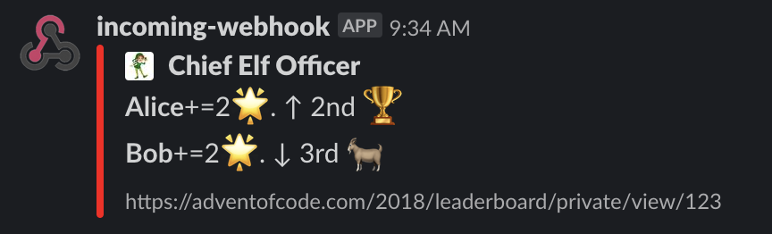

# Advent of Code Slack Notifier

## What?

This project is aimed at those participating in https://adventofcode.com/ and who are member of one ore
more private leaderboards.

This application will poll the AOC API, store the data in a DynamoDB and notify a Slack channel of your choice
if there has been a change in the leaderboard. 



## How it works

This projects runs on AWS and uses the following component:

* A Lambda to poll adventofcode.com API
* DynamoDB to store historical data
* A Lambda to compare the latest two polling events
* An SQS queue to pass data between the two lambdas


This project also uses the following frameworks:

* [Serverless](https://github.com/serverless/serverless) to deploy and manage the AWS resources
* [Spring Boot](https://spring.io/projects/spring-boot) to bootstrap the Java code
* [Spring Cloud Function](https://spring.io/projects/spring-cloud-function) to integrate between Serverless and Spring
* [jslack](https://github.com/seratch/jslack) to talk to the slack API

## Prerequisites

To run this project you need to do the following:

* (JDK 11 [or above] and Maven) OR (Docker)
* Create an AWS account and and IAM user configured in your `~/.aws/credentials` file. See [AWS tutorial](https://docs.aws.amazon.com/cli/latest/userguide/cli-chap-install.html) for help
* Install Serverless via npm as explained [here](https://github.com/serverless/serverless#quick-start)
* [Create a Slack Incoming Webhook](https://api.slack.com/messaging/webhooks) in your Slack environment and make sure you know the token. If your slack
webhook is `https://hooks.slack.com/services/abc/123` then your token is `abc/123`
* You are member of a AOC leaderboard and you know the id, typically `https://adventofcode.com/2019/leaderboard/private/view/<id>`
* You are logged in adventofcode.com and you know your sessionId (to get it just inspect the network and look at the `cookie` header: e.g. `session=123...`)

## How to run

### Step 1 - Configure your leaderboard(s)

You need to configure one or more leaderboard to poll. To do so update `src/resource/application.yml`:

```yaml
polling:
  leaderboards:
    - leaderboardId: '<leaderboard ID>'
      year: '<year e.g. 2019>'
      slackToken: '<the slack token mentioned above>'
```

You can poll multiple leaderboard by adding more elements to the `leaderboards` list:

```yaml
polling:
  leaderboards:
    - leaderboardId: '123'
      year: '2019'
      slackToken: 'abc/def'
    - leaderboardId: '345'
      year: '2019'
      slackToken: 'xxx/yyy'

```

### Step 2: Build the project.
In the folder where you have checked out this project run the following command:

If you have Java 11 and Maven install locally just run:

```shell script
mvn package -DskipTests
```

Alternatively if you have Docker installed locally you can simply run:

```shell script
./buildWithDocker.sh
```

### Step 3: Deploy to AWS

```shell script
serverless deploy --sessionid <aocSessionId>
```

To remove all AWS resources simply run

```shell script
serverless remove --sessionid <aocSessionId>
```

The polling uses the cron expression `0 */1 * * ? *` by default (i.e. every hour). If you want to change this just
add a `-schedule 'cron(<write cron here>)'` argument to the deploy command.

However please see this message from https://adventofcode.com:

>Please don't make frequent automated requests to this service - avoid sending requests more often than once every 15 minutes (900 seconds).

## Troubleshooting

* If your session cookie expires, just get another by refreshing your browser session and just
rerun the deploy command above. 

## TODO

* write more tests
* compute hash of AOC response and don't save new dynamo DB event if there was no change
* Ability to customise Slack message with env variable
* Use block kit to write slack message
* Could add more complex logic in Slack by getting info from the
* Process dynamoDB data to draw interesting graph of ranks/stars in time